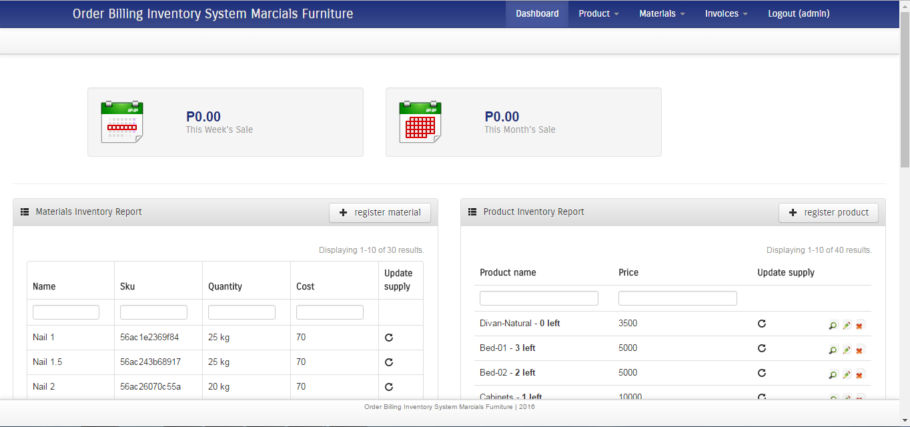
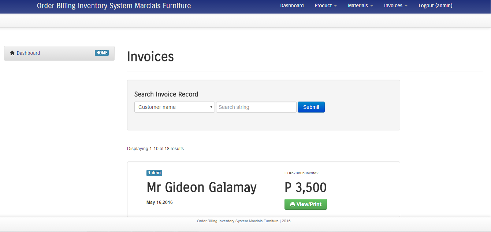
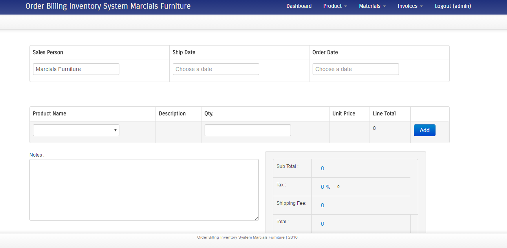
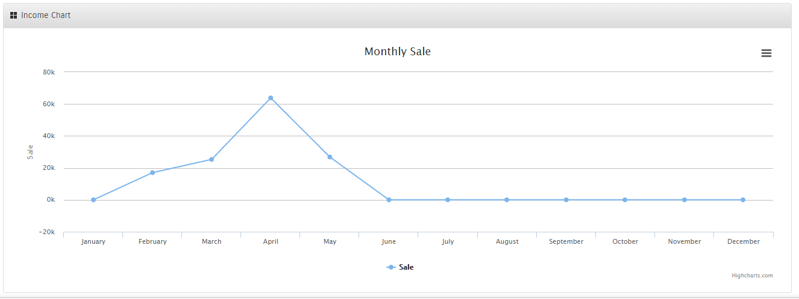

## Marcials Order-Billing and Inventory System 
License: GPLv2 or later
License URI: http://www.gnu.org/licenses/gpl-2.0.html
####== Description ==
Features : 
* monthly report
* invoice creation
* invoice printing
* product and material management
* production notification = reports whether material is sufficient to create a product

####== Requirement ==
* Apache : 2.4.9 or higher
* MySQL : 5.6.17 or higher
* PHP : 5.5.12 or higher
* Composer : 5.5.12 or higher
* Git : 2.14.2 or higher
* ```php.exe``` should be included in the class path
* ```composer.exe``` or ```composer.bat``` should be included in the class path
####== Installation ==

##### Windows
1. Clone the project. ```git clone https://github.com/kevindaus/Order-Billing-Inventory-System-Marcials-Furniture.git``` 
1. 
1. Navigate to project directory and go to ```protected/```. 


####== Frequently Asked Questions ==

...

####== Screenshots ==

1. screenshot-1.jpg
1. screenshot-1.jpg

####== Changelog ==

List versions from most recent at top to oldest at bottom.

####== Upgrade Notice ==

Upgrade notices describe the reason a user should upgrade. No more than 300 characters.

####== Arbitrary section ==

You may provide arbitrary sections, in the same format as the ones above.  This may be of use for extremely complicated
plugins where more information needs to be conveyed that doesn't fit into the categories of "description" or
"installation."  Arbitrary sections will be shown below the built-in sections outlined above.

####== A brief Markdown Example ==

Ordered list:

1. Some feature
1. Another feature
1. Something else about the plugin

Unordered list:

* something
* something else
* third thing

Here's a link to [WordPress](http://wordpress.org/ "Your favorite software") and one to [Markdown's Syntax Documentation][markdown syntax].
Titles are optional, naturally.

[markdown syntax]: http://daringfireball.net/projects/markdown/syntax
			"Markdown is what the parser uses to process much of the readme file"

Markdown uses email style notation for blockquotes and I've been told:
> Asterisks for *emphasis*. Double it up for **strong**.

`<?php code(); // goes in backticks ?>`


<h3>
	Maricar Inventory System
</h3>
<p>
Features : <br>
* monthly report
<br>
* invoice creation
<br>
* invoice printing
<br>
* product and material management
<br>
* production notification = reports whether material is sufficient to create a product
</p>
<hr>







