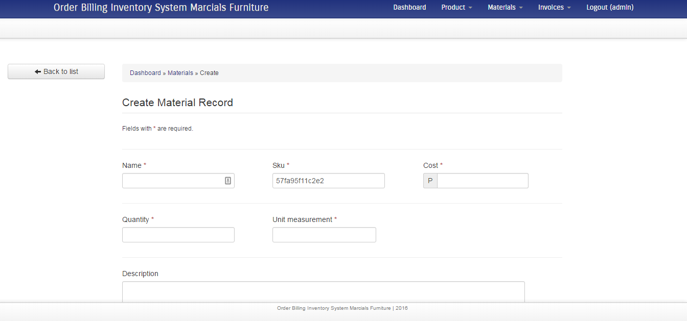
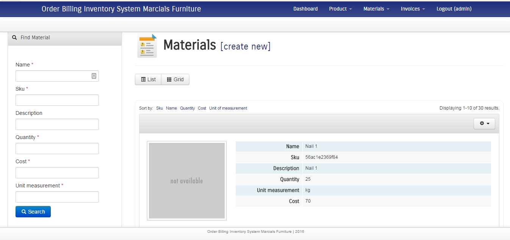

## Marcials Order-Billing and Inventory System 
License: GPLv2 or later
License URI: http://www.gnu.org/licenses/gpl-2.0.html
####== Description ==
Features : 
* monthly report
* invoice creation
* invoice printing
* product and material management
* production notification = reports whether material is sufficient to create a product

####== Requirement ==
* Apache : 2.4.9 or higher
* MySQL : 5.6.17 or higher
* PHP : 5.5.12 or higher
* Composer : 5.5.12 or higher
* Git : 2.14.2 or higher
* ```php.exe``` should be included in the class path
* ```composer.exe``` or ```composer.bat``` should be included in the class path
####== Installation ==

##### Windows
1. Clone the project. ```git clone https://github.com/kevindaus/Order-Billing-Inventory-System-Marcials-Furniture.git``` 
1. Edit ```protected/config/main.php``` . 
1. Update database configuration .
``` 
'db'=>array(
            'connectionString' => 'mysql:host=localhost;dbname=DATABASE_NAME',
            'emulatePrepare' => true,
            'username' => 'DATABASE_USERNAME',
            'password' => 'DATABASE_PASSWORD',
            'charset' => 'utf8',  
        ),
```
4. Edit ```protected/config/console.php``` . 
1. Update database configuration .
``` 
'db'=>array(
            'connectionString' => 'mysql:host=localhost;dbname=DATABASE_NAME',
            'emulatePrepare' => true,
            'username' => 'DATABASE_USERNAME',
            'password' => 'DATABASE_PASSWORD',
            'charset' => 'utf8',  
        ),
```
6. Navigate to project directory and go to ```protected/```. 
6. Double click ```install.bat```. 


####== Frequently Asked Questions ==

...

####== Screenshots ==








####== Changelog ==

1.0 = initial release 

####== Upgrade Notice ==
